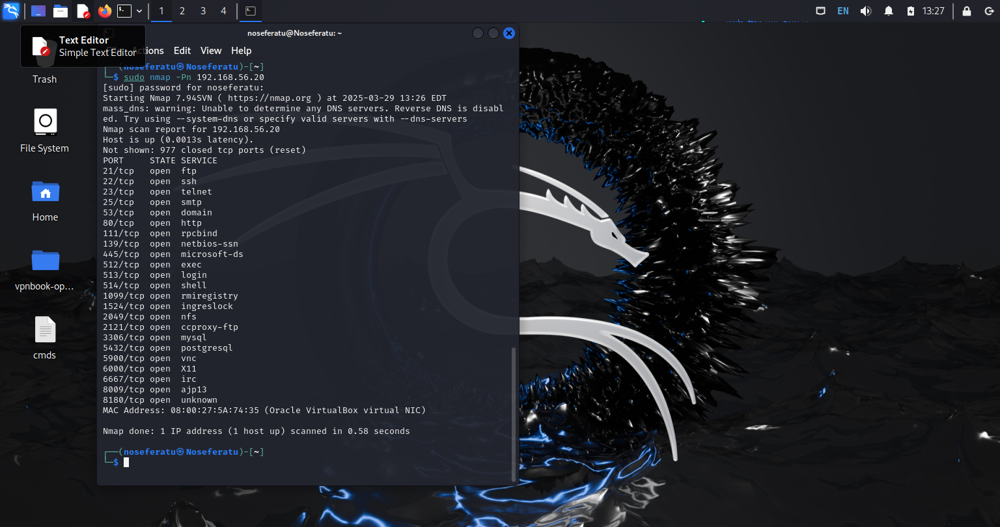

Alright so now that everything is setup for your homelab, we will run a basic nmap scan to check what ports are open on the victim (metasploitable 2 VM). 

```sh
sudo nmap -Pn 192.168.56.20
```



So lets go step by step, let's start with port 21 TCP open for FTP. 

Since Port 20 is not open, we can only try to send or get files via PASV (passive mode). 