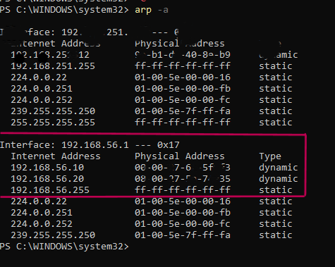

Here we will discuss how to manually setup and configure both VM's on the Host system 

First we need to find the Host adapter, to do that we will run ipconfig/all 


Now once we figure out the name of the adapter, we will switch to the VM Box to configure it. 

Your attacker (kalivm) should look like this. 


And your Metasploitable 2 (victim) should look like this. 


Now we will boot up both the vm's to test and see if they show up on the arp -a table in the host system. 

```sh
sudo arp -a
```

DHCP is known to cause issues if you already have a Hyper-V Virtual Ethernet Adapter. So to fix this, we will assign the IP's statically to avoid any issues with DHCP handling IP assignment. 

To handle this we will assign the IP's statically in Host system (win 11).

```sh
netsh interface ip set address name="ADAPTER_NAME" static IP_ADDRESS SUBNET_MASK
```

Also make sure that in the VM box Network Manager DHCP is set to "Disabled" and uncheck "Enable Server" in the same page. 


Now, we fireup both VM's and check the arp table in the host system to see if our VM's show up under the Host Adapter IP. 




Now we ping both the VM's from the host to see if they respond. 


Now we check the connectivity from the Kali VM (attacker). 


Now we check again to confirm. 


Now we check the connectivity from the Metasploitable2 victim VM  


Now, your homelab is all setup and good to go! :)


Troubleshooting -- 

In case, the arp -a table doesnt show the IP's of one or both VM's we can manually assign it to them. 

For that we will first check the conf file of network. 

```sh
cat /etc/network/interfaces
```


